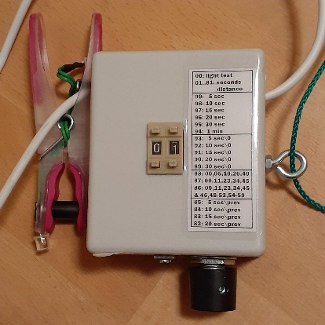
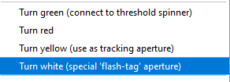
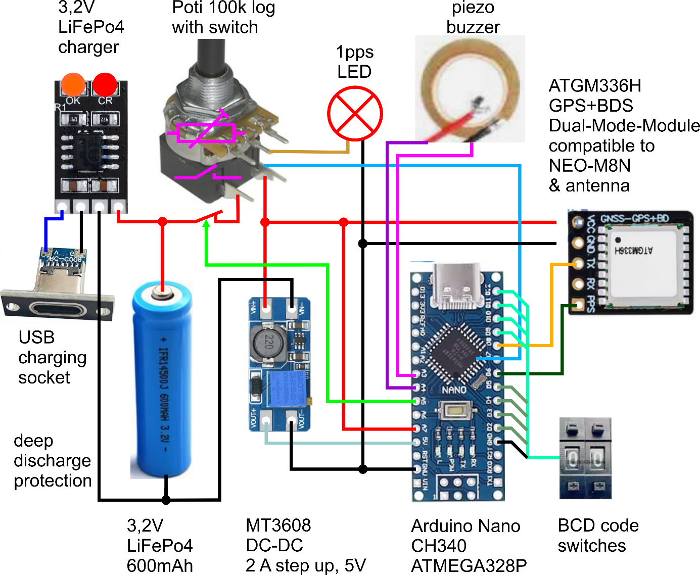
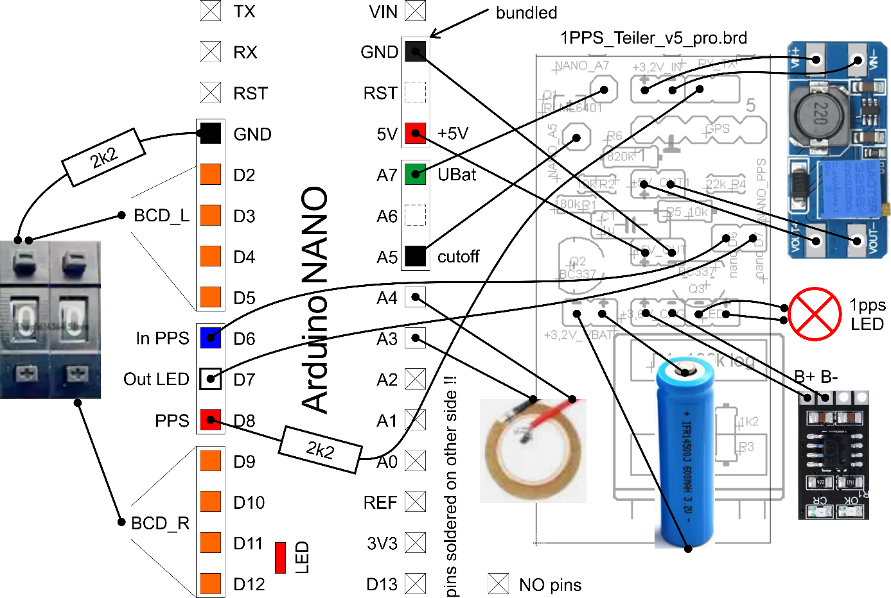
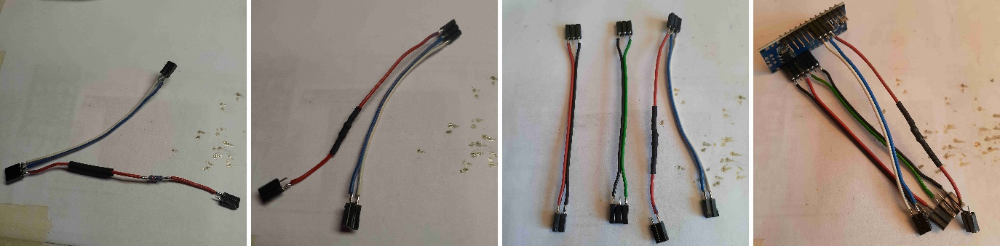
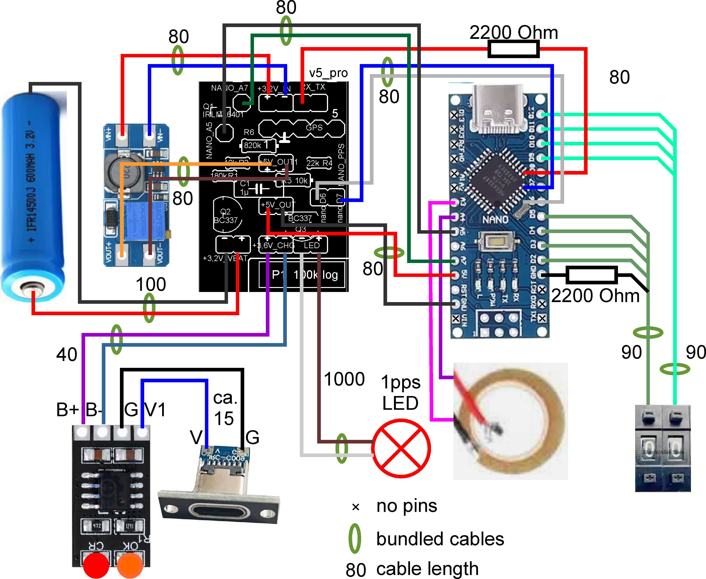
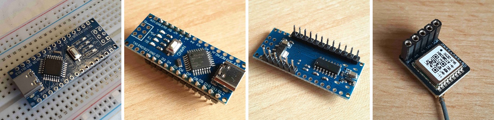
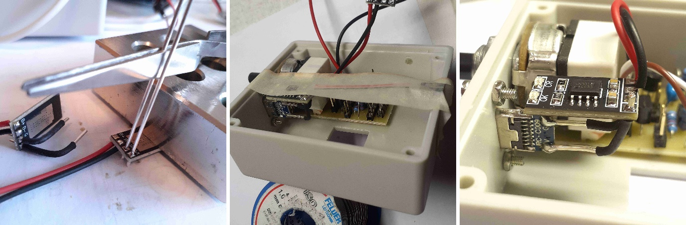
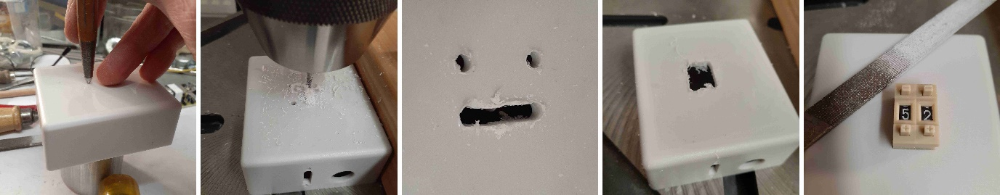
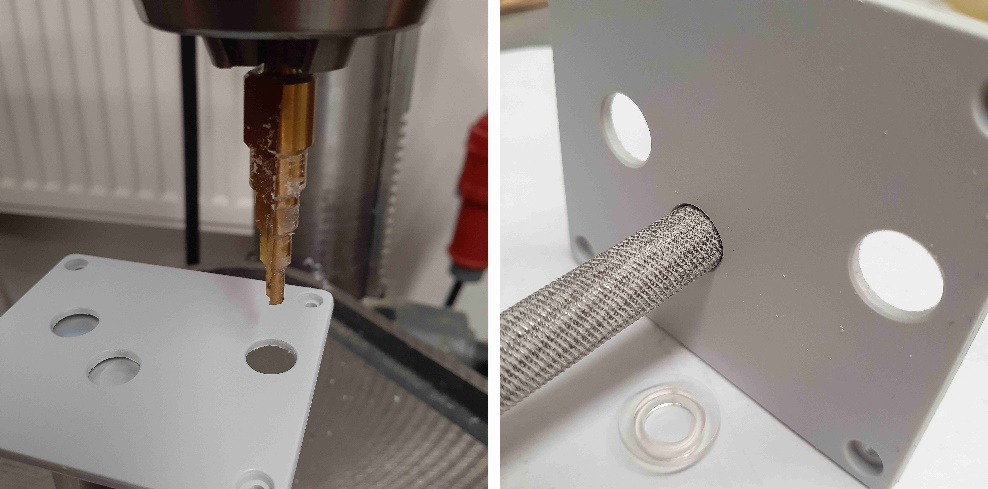

<h1 style="line-height:1.1; margin:0;">
Gerät mit GPS pps Blitz 
für das Setzen von optischen Zeitstempeln 
in astronomischen Videos von Digitalkameras
</h1>

<h2 style="margin-top:0.5em;">
Björn Kattentidt - IOTA/ES - <a href="mailto:bjoern@kattentidt-astro.de">bjoern@kattentidt-astro.de</a>
</h2>

**Motivation:**

Bisherige Analogkameras konnten mit VTI (video time inserter) im Videodatenstrom mit Zeitinformationen gestempelt werden. Moderne Digitalkameras ermöglichen dies nur mit aufwändiger Programmierung. Daraus ergaben sich viele auch sehr gute Kamerasysteme im Eigenbau mit erheblichem Aufwand. Mit modernsten „smart telescopes“ wird das Problem deutlich, daß es noch schwerer möglich sein wird die speziellen Wünsche nach Zeitmarken mit Genauigkeit im Bereich von Millisekunden in Videos zu realisieren.

Ein Gerät wird interessant sein, welches man an jede beliebige Optik anbringt und beim Anschalten nach wenigen Minuten NMEA-Daten verwendet um die Anforderungen für Auswertung von Zeitmarken in Sternbedeckungsvideos zu erfüllen. Ein solches wird hier vorgestellt.

Das System wird mit freiem Quellcode veröffentlicht.

Das Gerät ist für den Selbstbau (DIY) gedacht. Der Autor unterstützt aber gerne bei Hinweisen zur Teilebeschaffung und der Umsetzung zum fertigen Gerät.\
Diese Veröffentlichung soll dazu beitragen den Nachbau selbständig durchzuführen.

**Eigenschaften im Überblick:**

- pps Blitz (40 ms) mittels LED an Klammer mit Leitung (ca. 1 m) zum Steuergerät

- Helligkeit über Drehpotentiometer mit integriertem Schalter einstellbar

- Zeitliche Blitzdistanz in weiten Bereichen mit zwei BCD Kodierrädern einstellbar

- Diverse Modi voreingestellt am oberen Zahlenbereich, bis 100 Modi möglich

- Sonderfunktionen: Keine Einstellung notwendig, GPS wird für GPS synchrone Blitzmuster verwendet. Mit ungültigem GPS-Signal wechselt die interne Arduino LED im Sekundentakt und die LED an der Klammer blitzt dann jede Sekunde den pps.

- 3,2 V LiFePo4 Akku mit 600 mAh, Verbrauch: typisch 80 mA

- Betriebsdauer ca. 7 Stunden

- Letzte 0,5 … 1 Stunde „low batt.“ Anzeige durch schnell blinkende Status-LED

- Tiefentladeschutz: Gerät schaltet ab, Reststrom 2mA, alle LED aus

- 2h Laden über USB-C, Ladegerät integriert.\
  Unteres Fenster: Rotes Licht „Laden“, oranges Licht “Voll“

- Arduino NANO mit open source Kode über DC-DC Wandler (3,2 V zu 5,0 V)

- GPS Modul ATGM336H (3,2 V) GPS+BD\
  Warmstart 10-25 Sek. (Autor), Kaltstart 35 Sek. (Hersteller),\
  bis zu einigen Minuten bei ungünstigem Empfang\
  Mittleres Fenster: pps GPS Bereitschaft durch invertiert blinkende LED

- Schritt für Schritt Anleitung zum Selbstbau

- Zweitlösung für Zeitmarken in Bedeckungsvideos, wenn das primäre Zeitsystem aus technischen Gründen plötzlich ausfällt

Abbildung 1: GPS pps Blitzer, fertiges Gerät

**Funktionalität:**

Eine blitzende LED ist an einer Klammer angebracht. Diese ist mit einer Leitung mit dem Steuergerät verbunden um die mechanische Last an der Optik zu verringern und die Bedienung wackelfrei zu ermöglichen.

Die Klammer wird an die Taukappe der Optik mit LED nach innen in den Strahlengang angeklemmt. Bei großem Abstand zum Rand des Strahlengangs kann die Klammerweite modifiziert werden indem der schwarze Zylinder verlängert wird.

Der Code ist derart optimiert, daß die Blitze weniger als 100 µs nach dem pps Signal (peak per second) des GPS erscheinen. Die loop-Zeit beträgt unter 0,25 ms. Das Lichtsignal ist demnach deutlich weniger als 1 ms verzögert. Eigene Messungen mithilfe einer DVTI ergaben maximal 2ms. Dies ist aber derzeit noch nicht zuverlässig nachgemessen worden und muß noch mittels EXTA festgestellt werden!

Der Blitz hat außer bei \#00 immer dieselbe Dauer von 40ms.

Im Modus \#00 leuchtet die LED lang. So kann die Helligkeit mit dem Schaltpotentiometer eingestellt werden. Am besten sieht man gerade noch ein schwaches Aufleuchten im Video. PyOTE kann sogar Markierungen auswerten, wenn man das Blitzen nicht mehr sieht.

Die speziellen Funktionen (#87-#99) verwenden dagegen NMEA-Daten, auch für die Sekunde, während die zeitliche Triggerung über das deutlich genauere pps-Signal verwendet wird.\
Erst mit gültigen NMEA-Daten arbeiten die Sonderfunktionen wie erwartet und die obere obere Status-LED am Arduino NANO verlischt! Bei ungültigen oder keinen NMEA-Daten blinkt die obere Status-LED langsam (wechselt jede Sekunde).

Bei vollem Akku wird das Gerät ca. 7 Stunden blitzen wobei die letzte halbe bis eine Stunde die Status-LED schnell blinkt. Dann versetzt der Tiefentladeschutz das Gerät in den Ruhemodus mit 2 mA Reststrom. Das Gerät muß zum Schutz des Akkus dennoch mit dem Schalter vollständig abgeschaltet werden! Der Akku hat 600 mAh Kapazität bei max. 80 mA Verbrauch. Der Akku wird über den USB-C Anschluß geladen. Ein Ladegerät ist dazu integriert. Das Steuergerät kann im ausgeschalten Zustand oder auch während des Betriebs über die USB-Buchse geladen werden. Dennoch ist es besser während des Betriebs nicht zu laden zum Schutz des GPS-Moduls, welches dann mit dem Akku verbunden ist. Die Ladezeit beträgt ca. zwei Stunden.

Ein Tiefentladeschutz ist implementiert. Bei geringer Spannung (3,1 V) blinkt die obere Status-LED in schneller Folge (4 Hertz). Bei Entladeschlußspannung (2,8 V) schaltet sich das Gerät in den Ruhemodus. Ist der Tiefentladeschutz aktiviert, gehen alle LED aus. Es fließt aber noch ein Reststrom wodurch der Akku nach weiteren 2 Tagen tiefentladen wird. <u>Daher muß das Gerät immer per Schalter ausgeschaltet werden, denn eine einzige Tiefentladung kann den LiFePo4 Akku zerstören.</u>\
Das Gerät kann reaktiviert werden, indem man es am Drehknopf ausschaltet, und wieder anschaltet. Geht es sofort wieder aus mit dem Anschalten ein paar Sekunden warten.

**Übliche Benutzung:**

Gerät an der Öse aufhängen oder mit Öse zum Zenit aufstellen, dann hat das GPS optimalen Empfang.

Die Klammer an der Taukappe anklemmen mit der LED im Strahlengang in die Optik zeigend.

Mit Drehknopf nach rechts einschalten.

Zunächst ist die 1pps-LED dauerhaft an und die Status-LED blinkt im Sekundenrhythmus, weil noch kein pps-Signal und keine NMEA Daten erkannt wurden. Wenn die Status-LED aus ist und das 1pps-Signal im Sekundenrhythmus kurz aus geht, ist das Gerät betriebsbereit.\
Dies wird unter freiem Himmel binnen einer Minute geschehen, manchmal dauert es mehrere Minuten.

Blinkt die Status-LED langsam, liegen noch keine gültigen NMEA Daten vor. Damit können die speziellen Funktionen von \#99 abwärts bis \#82 nicht verwendet werden. Allerdings kann das exakte 1pps-Signal mit den Funktionen \#01 bis \#81 verwendet werden, wenn schon die 1pps-LED blinkt. Blinkt die Status-LED schnell, bedeutet dies, daß der Akku bald leer sein wird und das Gerät dann in den Ruhemodus ausschaltet.

Für die LED an der Klammer wird das exakte elektrische pps-Signal des GPS-Moduls verwendet.

Die Kodierräder zunächst auf \#00 stellen und die benötigte Helligkeit am Potentiometer einstellen.

Dann den gewünschten Modus einstellen. Man kann jederzeit in jeden anderen Modus mit den beiden Kodierrädern schalten. Nach einer Sekunde ist das Signal dann korrekt.\
Nun kann das Gerät benutzt werden um Millisekunden genaue Zeitstempel optisch zu setzen.

<u>Nach der Verwendung das Gerät am Drehknopf wieder abschalten!</u>

**Funktionsweise:**

An der Spitze der Klammer blitzt im Sekundentakt eine rote LED GPS synchron kurz auf. Wird die Zahl zum Beispiel auf \#11 gestellt blitzt die LED jede elfte Sekunde. So kann jede zyklische Wiederholung eingestellt werden und der Beginn mit etwas Übung auch mit Hilfe einer sehr genauen Uhr voreingestellt werden, indem man die Zahl beginnend bei \#01 geschwind höher stellt.

Zum Verständnis: Ein interner Zähler zählt nach einem Blitzen von Null an aufwärts bis er die eingestellte Zahl erreicht hat. Stellt man diese Zahl nach einem Blitzen zu bestimmter Sekunde höher, hat man die Sequenz auf den Beginn eingestellt.\
Bis die eingestellte Zahl vom Zähler überschritten wird, kann man weiter die Kodierräder einstellen. Mit etwas Geschick und Überlegung, etwa den Zehner zuerst zu stellen, bleibt ausreichend Zeit mit den Einstellungen fertig zu werden.

Dies ergibt zwar viele Freiheiten, aber diese Art der Einstellung erfordert Geschick und man benötigt noch eine genaue Zeit (Android: z.B. AtomUhr App). Startet und stoppt man das Video mit einer Roboter App (z.B. MacroDroid) bei Verwendung eines „smart telescope“ mit Mobiltelefon, dann sind Beginn und Ende des Videos sekundengenau, was die Feststellung der Minute wesentlich erleichtert.

Zur deutlich leichteren Nutzung ohne weitere Apps sind Sonderfunktionen von \#99 herab implementiert (siehe Liste). Diese Modi nutzen NMEA-Daten und der Blitz leuchtet daher immer genau zur eingestellten Sequenz entsprechend der GPS Sekunde auf!

Die Sonderfunktionen als auch längere Blitzabstände sind nur geeignet für Kameras bei denen auf Zeit Synchronität Verlaß ist wie etwa bei ASI Kameras, während sie weniger geeignet sind für QHY Kameras, welche eine Firmware zu haben scheinen, wodurch die echten Belichtungszeiten fluktuieren sowie unvorhersehbare Pausen erscheinen (eigene Erfahrung des Autors). Bei Belichtungszeiten über 0,1 Sekunden ist das allerdings wenig relevant für genaue Zeitstempel.

Hat man es eilig, muß man eine manuell einstellbare Blitzfolge verwenden und den Beginn selbst passend mit einer genauen Vergleichsuhr synchronisieren (Android: z.B. AtomUhr APP).

**Liste der verfügbaren Modi (erweiterbar)**

\#00: Nur zu Zwecken der Helligkeitseinstellung der LED an der Klammer.\
Die LED leuchtet 0,8 Sekunden lang nach jedem pps.

\#01 … \#81: Die LED blitzt im Abstand der eingestellten Sekunden. Dazwischen bleibt sie aus. Eine gezielte Einstellung kann erreicht werden gemäß Beschreibung im Abschnitt Verwendung.

<table>
<colgroup>
<col style="width: 14%" />
<col style="width: 61%" />
<col style="width: 13%" />
<col style="width: 9%" />
<col style="width: 0%" />
</colgroup>
<thead>
<tr>
<th style="text-align: center;">BCD</th>
<th style="text-align: center;">Blitze bei genannter GPS-Sekunde</th>
<th style="text-align: center;">LUT</th>
<th style="text-align: center;">(Kode)</th>
<th style="text-align: center;"></th>
</tr>
</thead>
<tbody>
<tr>
<td colspan="5" style="text-align: center;">Sekundenmaske vollständig synchron</td>
</tr>
<tr>
<td style="text-align: center;">#99</td>
<td style="text-align: center;">00, 05, 10, 15, 20, 25, 30, 35, 40, 45, 50, 55</td>
<td style="text-align: center;">LUT_05s</td>
<td style="text-align: center;">FF</td>
<td style="text-align: center;"></td>
</tr>
<tr>
<td style="text-align: center;">#98</td>
<td style="text-align: center;">00, 10, 20, 30, 40, 50</td>
<td style="text-align: center;">LUT_10s</td>
<td style="text-align: center;">FE</td>
<td style="text-align: center;"></td>
</tr>
<tr>
<td style="text-align: center;">#97</td>
<td style="text-align: center;">00, 15, 30, 45</td>
<td style="text-align: center;">LUT_15s</td>
<td style="text-align: center;">FD</td>
<td style="text-align: center;"></td>
</tr>
<tr>
<td style="text-align: center;">#96</td>
<td style="text-align: center;">00, 20, 40</td>
<td style="text-align: center;">LUT_20s</td>
<td style="text-align: center;">FC</td>
<td style="text-align: center;"></td>
</tr>
<tr>
<td style="text-align: center;">#95</td>
<td style="text-align: center;">00, 30</td>
<td style="text-align: center;">LUT_30s</td>
<td style="text-align: center;">FB</td>
<td style="text-align: center;"></td>
</tr>
<tr>
<td style="text-align: center;">#94</td>
<td style="text-align: center;">00</td>
<td style="text-align: center;"></td>
<td style="text-align: center;">FA</td>
<td style="text-align: center;"></td>
</tr>
<tr>
<td colspan="5" style="text-align: center;">Sekundenmaske mit Auslassung am Nulldurchgang (Minutenwechsel)</td>
</tr>
<tr>
<td style="text-align: center;">#93</td>
<td style="text-align: center;">05, 10, 15, 20, 25, 30, 35, 40, 45, 50, 55</td>
<td style="text-align: center;">LUT_05s0</td>
<td style="text-align: center;">EF</td>
<td style="text-align: center;"></td>
</tr>
<tr>
<td style="text-align: center;">#92</td>
<td style="text-align: center;">10, 20, 30, 40, 50</td>
<td style="text-align: center;">LUT_10s0</td>
<td style="text-align: center;">EE</td>
<td style="text-align: center;"></td>
</tr>
<tr>
<td style="text-align: center;">#91</td>
<td style="text-align: center;">15, 30, 45</td>
<td style="text-align: center;">LUT_15s0</td>
<td style="text-align: center;">ED</td>
<td style="text-align: center;"></td>
</tr>
<tr>
<td style="text-align: center;">#90</td>
<td style="text-align: center;">20, 40</td>
<td style="text-align: center;">LUT_20s0</td>
<td style="text-align: center;">EC</td>
<td style="text-align: center;"></td>
</tr>
<tr>
<td style="text-align: center;">#89</td>
<td style="text-align: center;">30</td>
<td style="text-align: center;">LUT_30s0</td>
<td style="text-align: center;">EB</td>
<td style="text-align: center;"></td>
</tr>
<tr>
<td colspan="5" style="text-align: center;">Sekundenmaske zeitlich kodiert</td>
</tr>
<tr>
<td style="text-align: center;">#88</td>
<td style="text-align: center;">00, 05, 10, 20, 40</td>
<td style="text-align: center;">LUT_DF</td>
<td style="text-align: center;">DF</td>
<td style="text-align: center;"></td>
</tr>
<tr>
<td style="text-align: center;">#87</td>
<td style="text-align: center;">00, 11, 23, 34, 45 (ähnlich Pseudo-Barker Kode)</td>
<td style="text-align: center;">LUT_DE</td>
<td style="text-align: center;">DE</td>
<td style="text-align: center;"></td>
</tr>
<tr>
<td style="text-align: center;">#86</td>
<td style="text-align: center;">00, 11, 23, 34, 45; Minute binär: 48-53 und 54-59, LSB beginnend, Paritätsbit 46</td>
<td style="text-align: center;">LUT_DD</td>
<td style="text-align: center;">DD</td>
<td style="text-align: center;"></td>
</tr>
<tr>
<td colspan="5" style="text-align: center;">Sekundenmaske ohne Vorlaufereignis vor dem Minutenwechsel</td>
</tr>
<tr>
<td style="text-align: center;">#85</td>
<td style="text-align: center;">00, 05, 10, 15, 20, 25, 30, 35, 40, 45, 50</td>
<td style="text-align: center;">LUT_05sv0</td>
<td style="text-align: center;">CF</td>
<td style="text-align: center;"></td>
</tr>
<tr>
<td style="text-align: center;">#84</td>
<td style="text-align: center;">00, 10, 20, 30, 40</td>
<td style="text-align: center;">LUT_10sv0</td>
<td style="text-align: center;">CE</td>
<td style="text-align: center;"></td>
</tr>
<tr>
<td style="text-align: center;">#83</td>
<td style="text-align: center;">00, 15, 30</td>
<td style="text-align: center;">LUT_15sv0</td>
<td style="text-align: center;">CD</td>
<td style="text-align: center;"></td>
</tr>
<tr>
<td style="text-align: center;">#82</td>
<td style="text-align: center;">00, 20</td>
<td style="text-align: center;">LUT_20sv0</td>
<td style="text-align: center;">CC</td>
<td style="text-align: center;"></td>
</tr>
<tr>
<td colspan="5" style="text-align: center;"></td>
</tr>
<tr>
<td style="text-align: center;">#01 … #81</td>
<td style="text-align: center;">Sekunden Abstand, beginnend mit beliebiger Sekunde</td>
<td style="text-align: center;"></td>
<td style="text-align: center;"></td>
<td style="text-align: center;"></td>
</tr>
</tbody>
</table>

Tabelle 1: Modi

Die Sequenzen \#94 und \#99 ermöglichen GPS-synchronisierte Blitze in äquidistantem Zeitabstand.

Die Sequenzen \#89 bis \#93 haben keinen Blitz bei GPS Sekunde 0 zur Einordnung der Blitze relativ zur Minute.

Die Sequenzen \#88 und \#87 erlauben es mit Wissen über die Minute des Beginns oder Ende des Videos zuverlässige Zeitangaben mit PyMovie/PyOTE zu ermitteln und zu prüfen.

Die Sequenz \#86 ist gleich wie \#87 aber mit zusätzlich integrierter Kodierung der Minute mit Wiederholung und Paritätsbit an fixen Positionen, ähnlich der Methode beim DCF77 Signal. Damit ist es nicht mehr nötig die Minute zu notieren.

Beispiel:\
1 0 0 0 1 1 binär = 35 dezimal: 35-te Minute, LSB kommt zuerst\
Anzahl 1-Bits ungerade, Parität = 1:\
Gesamtzahl der Einsen mit Parität gerade, das heißt gerade Parität\
Das Paritätsbit wird bei gerader Parität so berechnet, dass die Gesamtanzahl der Einsen gerade ist.

Abbildung 2: Modus #86, Minute 35

Die Sequenzen \#82 bis \#85 haben diesen fehlenden Blitz an letzter Stelle in der Minutensequenz. Damit läßt sich der Minutenbeginn leichter feststellen.

Vorteil der Sonderfunktionen liegt in der geringeren Störung der Lichtkurve durch die Blitze im Gegensatz zu einem Blitz in jeder Sekunde.\
Jegliche anderen Kodierungen können implementiert werden.

Nachteil der Sonderfunktionen ist, daß der Empfang der NMEA-Daten gültig sein muß, was länger dauern kann oder auch bei schlechtem Empfang Unterbrechungen erfahren kann.

Benutzt man nur das pps-Signal in den Modi \#01 bis \#81 ist es ausreichend wenn die LED des GPS blinkt.

**Vier nützliche Anwendungsfälle:**

\#01:\
LED blitzt jede Sekunde. Grundfunktion. Verwendung wenn sehr schnell ein genaues Sekundensignal notwendig wird oder Bilder bei hohen Bildraten verloren gehen oder wenn die Bildzeiten der Kamera jittern. Es müssen Minutenwechsel und Minute anders ermittelt werden, z.B. durch Notieren der Minute sowie Beginn des Videos per Automatismus zu bestimmter GPS-Sekunde.

\#85:\
LED blitzt alle 5 Sekunden außer in der 55-ten Sekunde. Bei gut erkennbaren Blitzen ist der Minutenwechsel gut auswertbar. Schnelle Ersatzlösung bei Versagen des Primärsystems. Minute muß notiert werden.

\#88:\
LED blitzt bei 00, 05, 10, 20 und 40 Sekunden. Mit wenig Blitzen hat man bei mehr als 2 Minuten langen Videos eine sichere Erkennung des Minutenwechsels. Minute muß notiert werden.

\#86\
Mit Blitzen bei 00, 11, 23, 34 und 45 Sekunden mit ungleichen Zeitabständen nach dem Pseudo-Barker Kode ist nach schon unter einer Minute der Minutenwechsel eindeutig. Die Minute ist in den 6 bit der 48-53-ten und 54-59-ten Sekunde ermittelbar. Kann verwendet werden, wenn man nicht die Minute notieren möchte, die Sekunde ist aber schwerer ablesbar. Paritätsbit für zusätzliche Sicherheit auf 46-ter Sekunde. Sicherste Methode bei Gefahr durchziehender Wolken. Dann besser mehrere Minuten Video aufnehmen.

**Video Auswertung:**

Die Blitze sind derzeit 40 ms lang (25 fps), sodaß die mit dem Drehknopf eingestellte Helligkeit des Blitzes über alle Belichtungszeiten an einer Optik gleichbleibt. Die Blitze können so schwach eingestellt werden, daß sie fast nicht sichtbar sind, die Auswertung nicht beeinflussen aber dennoch sicher mit PyMovie (white aperture) und PyOTE erkannt werden können. Bei maximaler Leuchtstärke sieht man den Blitz sicher. Dies ist kaum abhängig von der Teleskopgröße!

PyOTE: 

**Elektrische Übersicht:**

Abbildung 3: Elektrischer Zusammenhang illustriert

**Elektrischer Aufbau:**

<u>Schaltplan</u> Verbindungs-Leiterplatte (1PPS_Teiler_v5_pro.sch)\
Diese Leiterplatte dient hauptsächlich dazu die Verbindungen zwischen den Geräten mit Steckverbindungen zu realisieren. So können die gezeigten modularen Komponenten des nur teils gelöteten Geräts leicht ausgetauscht, getestet oder bei Defekt ersetzt werden. Wer sichere elektrische Verbindungen bevorzugt, kann mehr oder alles als Lötverbindung ausführen. Steckverbindungen mit Stiftleisten und Buchsenleisten sind aber ausreichend.

Abbildung 4: Schaltplan der Verbindungsleiterplatte mit EAGLE [1]

Hinweis: Der Widerstand R7 muß in die Leitung gelötet werden, nicht auf die Platine bei Leiterplatte 1PPS_Teiler_v5_pro! Erst bei 1PPS_Teiler_v6_pro ist das design passend geändert, aber noch nicht verfügbar.

<u>Teileliste</u> (1PPS_Teiler_v5_pro.sch)

| Part | Value |
|----|----|
| C1 | 1µ keramisch |
| P1 | 100k log. |
| Q1 | IRLML6401 oder p-Kanal MOSFET mit RDS (\< 1 Ohm) und UDSthd (\< 1 V) |
| Q2 | BC337-40 o.ä. |
| Q3 | BC337-40 o.ä. |
| R1 | 180k |
| R2 | 10k |
| R3 | 1k2 |
| R4 | 22k |
| R5 | 10k |
| R6 | 820k |

Tabelle 2: Teileliste

<u>Leiterplatte:</u> 1PPS_Teiler_v5_pro.brd

Abbildung 5: Leiterplatte Leiterseite, Bestückung, kombiniert (EAGLE) [1]

**Programmierung:**

Im open-source Programmkode \[2\] sind Werte, welche beachtet werden sollen, mit „// SET: …“ kommentiert. Darüber hinaus wird auf Kommentare im Kode verwiesen.

Zum Programmieren wurde die Arduino IDE \[3\] verwendet.

Es wurden folgende externe Bibliotheken im Kode eingebunden: \#include\
\<AltSoftSerial.h\> \[4\], sehr stabile, serielle Schnittstelle für GPS (Timer-basiert)\
\<TinyGPS++.h\> \[5\], parsen von NMEA-GPS-Daten (Zeit, Status)

AltSoftSerial ist pin-fest verdrahtet (Arduino Nano): RX = Pin D8\
Nicht kompatibel mit Boards wie ESP32, ESP8266 oder Leonardo ohne Anpassung.

Alle anderen Dinge im Kode kommen dem Arduino-Standard-Core aus.

**Signalfluß:**

Das digitale Signal vom ATGM336H Pin 5 (PPS) liest der Arduino NANO über seinen Pin D6 (code: PinInPPS) nach Spannungsadaption auf der Leiterplatte. Dieses pps-Signal wird für zeitsynchrone Blitze der LED an der Klammer über Arduino NANO Pin D7 (code: SigOut) bereitgestellt. Die NMEA-Daten werden über Arduino NANO Pin D8 (code: AltSoftSerial) für sekundenrichtige Einordnung in den speziellen Funktionen gelesen. Damit werden die NMEA-Daten für Sekunde und Minute ausgewertet und in oberen Modi (#99 abwärts) zur Kodierung verwendet.\
Das linke Zählerrad wird an D2 … D5 und an GND gesteckt, das rechte an D9 … D12.\
Achtung!: Sowohl in die Leitung zu D8 als auch vom (linken) BCD Kodierrad zum GND Pin muß ein 2200 Ohm Widerstand eingelötet werden! An GND geschieht dies zum Schutz des ports D9 und an D8 damit die NMEA Daten zuverlässig gelesen werden.

Die Spannung für den Tiefentladeschutz wird an A7 gelesen und die Abschaltung über A5 getätigt. Der Arduino NANO schaltet die gesamte Stromversorgung über eine Schaltung mit zwei Transistoren bis auf einen kleinen Reststrom ab.\

Abbildung 6: Elektrische Verbindungen

**Zusammenbau:**

Es ist erforderlich schon Erfahrung mit Elektroniklöten gemacht zu haben!\
Auch mechanische Handfertigkeit ist sehr von Vorteil.\
Wichtig: Beim Löten, besonders bei den Leitungen während des Lötens die Bauteile nie berühren, sondern vor dem Löten fixieren (Klammern, Kreppklebeband). „Kalte Lötstellen“ führen zum früheren Ausfall oder zum Nichtfunktionieren des fertigen Geräts. Nur so heiß löten wie erforderlich. Das Lot darf fast keinen Rauch abgeben und eine Lötung muß nach wenigen Sekunden fertig sein. Das Lot muß fließen und erkaltet eine glänzende Oberfläche haben. Die Lötstelle nicht bewegen bis das Lot fest ist!

Abbildung 7: Löten von Kabeln und Pins

Diese Steckverbindungen müssen angefertigt werden, eine hat einen 2200 Ohm Widerstand:

Abbildung 8: Benötigte Steckverbindungen

Es werden Schnittlängen (mm) für die flexiblen Leitungen gemäß Grafik vorgeschlagen.\
Es sollten eher kürzere als längere Maße verwendet werden.

Abbildung 9: Leitungslängen und -arten illustriert

Farben zur Visualisierung können von Farben der Leitungen abweichen!

**Leiterplatte:**

An der Leiterplatte muß eine Aussparung für eine Ecke geschnitten werden.

Löte in folgender Reihenfolge: Brücke auf Oberseite, Widerstände (liegend, dann stehend), Transistoren, ein SMD MOSFET auf der Leiterseite!, Pin-Stiftleisten (mit aufgesteckten Buchsen als seitliche Abstandshilfe), Kondensator, zuletzt Schalt-Drehpotentiometer und lange Stiftleiste für GPS. Kürze den Schaft des Potentiometers auf 10 mm. Das SMD-Bauteil am besten vor dem Löten mit doppelseitigem Klebeband fixieren.

Nach dem Löten überstehende Drähte auf Leiterseite kürzen bis zur Lötstelle. Auch beim Potentiometer. Danach auf einem einem Schmirgel (320er) beim Potentiometer sehr flach auf 1 mm Resthöhe schleifen. Mit einem Schwingschleifer geht diese Arbeit leichter. Dies ist nötig, damit das Potentiometer in das Gehäuse paßt. Metallstäube gründlich entfernen!

Der Pin „RX“ wird nicht verwendet und bleibt frei.\
Alle anderen Pinstifte werden mit Leitungen belegt.

Abbildung 10: Leiterplatte für Verbindungen der Geräte

**Kodierräder und DC-DC Wandler:**

Leitungen am DC-DC Wandler und an den Kodierrädern anlöten. Die Kodierräder einzeln löten. Die Kodierräder aufeinander stecken und dann die Masse (hier schwarz) mit einer Drahtbrücke verbinden. Dabei soll die Masseleitung an der linken Ziffer angelötet sein. Andernfalls kann dies im Arduino Kode umgestellt werden (LCcodeswiOrder).

Achtung!: In die gemeinsame Masseleitung muß ein 2200 Ohm Widerstand eingelötet werden, damit Ports des Arduino Nano geschützt sind. Auf dem Bild nicht gezeigt.

Die vier äußeren, überstehenden Stifte an der Gehäuseseite vorsichtig bündig abschneiden. Dabei nicht die vier Kunststoffniete beschädigen, die das Gehäuse zusammen halten.

Abbildung 11: Bündelleitung an Kodierrädern und DC-DC-Wandler

**Arduino NANO:**

Stiftleisten auf der dem Reset-Taster und LEDs <u>gegenüber</u> liegenden Seite löten! Nur die benötigten Stifte einlöten: 6 Ports von GND bis A5 und 12 Ports von GND bis D12. Besondere Aufmerksamkeit sollte man dabei auf die richtige Position der Pin-Leisten verwenden!! Ein Steckbrett erleichtert das Löten senkrechter Stiftleisten erheblich.\
Die LED „POW“ sowie „TX“ mit undurchsichtigem Material abdecken (Isolierband, Schrumpfschlauch, „flüssiges Gummi“). Ihr Licht stört die Anzeige der LED „L“ welche später eine schwache Batterie oder ungültige NMEA-Daten anzeigt.\
Die Pins RST und A6 bleiben später frei.

Abbildung 12: Stift- und Buchsenleisten am Arduino NANO und dem GPS-Modul

**GPS-Modul:**

Die Buchsenleiste (5-pol) auf der Seite mit dem großen quadratischen IC <u>gegenüber</u> der Seite des Antennenanschluß auflöten.\
Das Antennenkabel muß sehr vorsichtig mit starkem Druck und nicht verkantet aufgedrückt werden. Es rastet mit einem Klick ein und ist danach verdrehbar fixiert.\
Vorsicht: Der Antennenanschluß darf das silberne zylindrische Bauelement nach Verdrehen keinesfalls berühren, denn dieser Kurzschluß führt mindestens zum Nichtfunktionieren des 4GPS.\
Antennenkabel geeignet ohne Knicke verlegen! Die Antenne paßt zwischen Potentiometer und Gehäuse. Die Seite mit der grünen Leiterplatte und dem Metallkästchen muß für optimalen Empfang zum Himmel gerichtet sein.

**Ladegerät:**

Das integrierte Ladegerät wird über den USB-C Anschluß versorgt und ist direkt mit dem Akku verbunden. Eine rote LED bedeutet, daß geladen wird, eine orange LED, daß der Akku vollgeladen ist. Die Ladedauer beträgt etwa 2 Stunden.\
Hinweis: Damit die LED des Lademoduls sich an bestimmter Stelle befinden, wird empfohlen die Leitungen an den USB-Anschluß als Draht auszuführen.

Abbildung 13: Ladegerät für den LiFePo4 Akkumulator

**Gehäuse:**

Für die mechanischen Arbeiten werden hier einige hilfreiche Tips gegeben. Man hat am besten eine kleine Werkstatt und Basiswerkzeuge (Feilen, Sägen, Fräser, Stechbeitel, Schleifpapier, Tischbohrmaschine, kleine Handbohrmaschine, Schraubstock, Werktisch). Je weniger Werkzeuge verfügbar sind, desto geschickter muß man damit umgehen können!

Abbildung 14: Gehäuse Maßzeichnung

Die rechteckige Öffnung für die **Kodierräder** muß sehr genau positioniert (0,5mm) und als Preßpassung ausgeführt werden. Andernfalls müssen die Kodierräder innen mit Heißkleber fixiert werden.\
Die künftige Aussparung anreißen. Dazu die Fläche mit Klebeband abdecken, damit die Ritzungen das Gehäuse nicht beschädigen. Zunächst die Fräsungen mit Untermaß auf einer Tischbohrmaschine fertigen, indem man das Werkstück an einem Führungsklotz entlang führt. Zug um Zug die Löcher stirnfäsen und diese dann mithilfe der Führung seitenfräsen.

Abbildung 15: Anfertigen der Öffnung im Gehäuse für die Kodierräder

Die Feinarbeit geschieht mit einer rechteckigen Schlüsselfeile bis zum Spielmaß. Dabei stets mit Meßschieber nachmessen, damit eine Preßpassung für die Zählräder an der langen Seite entsteht!

In gleicher Weise den Schlitz für den **USB-Ladeanschluß** anbringen.\
Mit einer 3 mm Rundfeile von außen zu den Schraublöchern hin eine Fase anbringen, damit das USB-Bauteil bündig am Gehäuse anliegt. Das USB-Bauteil anlegen und die 2 mm Bohrungen passend anbringen. Dazu für die zweite Bohrung eine Schraube einsetzen.

Abbildung 16: Anfertigung der Öffnung im Gehäuse für den USB-C Ladeanschluß

Für das **Schalt-Drehpotentiometer** ist in der Höhe 0,1 mm Genauigkeit erforderlich, sonst paßt später der Deckel nicht darauf. Wenn er zuletzt doch nicht paßt, innen am Deckel eine flache Fräsung oder Anschliff mit Feinmechanik-Handschleifer (D ~15mm) anbringen oder das Loch mit Rundfeile entsprechend erweitern.

Der **Batteriehalter** paßt nicht ganz in die Gehäuseflanke. Mit einem Stechbeitel kann man den unteren Teil der zwei Säulen im Gehäuse soweit entfernen, daß der Batteriehalter vollständig in die Flanke paßt. Es ist nicht empfohlen den Batteriehalter passend zu bearbeiten.

Die Positionen für die LED-Linsen im **Gehäusedeckel** müssen möglicherweise im Millimeter­bereich gegenüber der Maßzeichnung angepaßt werden. Diese Arbeit also erst kurz vor Vollendung nachholen. Die 3 Löcher anreißen und auf 10 mm mit einem Stufenbohrer aufbohren. Dann mit einer 10 mm Rundfeile eine Preßpassung für die Linsen herstellen. Achtung: Die Linse muß beim GPS und beim Arduino NANO bündig zur Deckelinnenseite gekürzt werden. Andernfalls könnte Druck auf das GPS-Modul ausgeübt werden und beim Arduino der Reset-Taster gedrückt werden. Es sollte auch an eine Abflachung an der Deckelinnenseite am Ort des Reset-Tasters des Arduino NANO gedacht werden.

Abbildung 17: Anfertigung der Öffnung im Gehäusedeckel für die „Linsen“

Wer die LED-Linsen nicht verwenden will kann auch wie folgt vorgehen:\
Am Gehäusedeckel an den Positionen der LEDs Löcher bohren (5mm), beidseits entgraten und mit klarem Heißkleber verschließen. So entstehen etwas opake Sichtfenster.\
Am besten verwendet man dazu 2 Stück Teflon (0,5mm Stärke), legt eines unter den Deckel auf einen Metalltisch und drückt den Deckel fest an den Tisch. Dann gibt man eine passende Menge Heißkleber in das Loch, legt geschwind das zweite Stück Teflon oben auf und preßt mit einem Finger im Handschuh (heiß!) für etwa 20 Sekunden fest darauf. Nach einer weiteren Minute vorsichtig das Teflon entfernen. Außen sollte nun kein Überstand vorhanden sein, sonst diesen außen und wenn nötig auch innen mit Stechbeitel vorsichtig glätten. Bei Nichtgefallen kann man ausbohren und es erneut versuchen oder die Löcher vergrößern.

**Finaler Zusammenbau:**

Die Pin-Stiftleisten mit Länge 6 und 12 am Ardiono NANO löten wie beschrieben und die 5-Pin-Buchsenleiste am GPS-Modul.

Steckverbindungen an Leitungen löten, wenn diese nicht schon mit Steckbuchsen versehen sind.\
ACHTUNG! Mit der Leiterplatte 1PPS_Teiler_v5_pro.brd muß in das Kabel für die GPS Daten (TX mittig am GPS an NANO D8) noch ein 2200 Ohm Widerstand eingelötet werden, sonst werden die Daten vom Arduino NANO nicht erkannt!! Beim 1PPS_Teiler_v6_pro.brd wird dieser auf die Leiterplatte aufgebracht.

Die USB-Ladebuchse am Gehäuse anschrauben. Die untere Mutter mit einer Spitzzange halten. Die Leiterplatte der USB-Ladebuchse paßt dazwischen.\
Das USB-Ladegerät (G, V1) mit kurzen stabilen Drähten richtig gepolt an den USB-Anschluß (G, V) löten. Die Position der LEDs am USB-Ladegerät soll sich unter der entsprechenden Linse im Deckel befinden!

Steckbuchsen an USB-Ladegerät (B+, B-) Leitungen löten. Den USB-Anschluß an irgendeine Spannungsquelle anschließen und prüfen, daß die rote Lade-LED leuchtet.

Den DC-DC Wandler auf 5,0 V einstellen.

Das Kabel mit der LED an der Klammer in das Gehäuse führen, mit Kabelbinder oder Heißkleber innen fixieren. Steckbuchse an die Litzen löten.

Steckbuchsen an Leitungen vom Batteriehalter löten.

Das Schalt-Drehpotentiometer im Gehäuse anschrauben, Drehknopf anbringen.

Die Öse befestigen.

Die Leitungen der Kodierräder durch das Loch fädeln und die Kodierräder einpressen, wenn nötig mit Heißkleber innen fixieren.

Abbildung 18: Unterbringung der einzelnen Geräte im Gehäuse

Alle Steckverbindungen wie folgt richtig aufstecken: (port Name/Leiterplatte)\
vom Ladegerät (B+, B-) zur Leiterplatte (+3,6V_CHG)\
Kabel der LED an der Klammer zur Leiterplatte (LED)\
vom Batteriehalter zur Leiterplatte (+3,2V_VBAT)\
vom DC-DC Wandler VOUT zur Leiterplatte (+5V_OUT)\
vom DC-DC Wandler VIN (+ und - gebündelt) zur Leiterplatte (+3,2V_IN)\
vom Arduino NANO (D6) zur Leiterplatte (NANO D6), Kode: PinInPPS, PPS Eingang\
vom Arduino NANO (D7) zur Leiterplatte (NANO D7), Kode: SigOut, LED Klammer\
GPS Datenleitung vom Arduino NANO (D8) zur Leiterplatte (RX, mittlerer Pin am Modul)\
vom Arduino NANO (A5) zur Leiterplatte (NANO_A5), Kode: cutoffPinOut, Tiefentladeschutz\
vom Arduino NANO (A7) zur Leiterplatte (NANO_A7), Kode: UBatanaIn, U Batterie Eingang\
vom Arduino NANO (GND, 5V) zur Leiterplatte (+5V_OUT1)

Steckverbinder von Kodierrädern zum Arduino NANO: GND, D2…D5 von der linken Ziffer, D9…D12 von der rechten Ziffer und zuletzt das GPS-Modul mit Antenne (GPS) auf die fünf langen Pins stecken. Die Antenne in den freien Raum neben dem Potentiometer legen, das Kabel vorsichtig verlegen.

Dann den LiFePo4-Akku in den Batteriehalter einsetzen. Zum elektrischen Test anschalten und die Funktion des Geräts im Modus \#00 und \#01 im Freien überprüfen.\
Es ist hilfreich zuerst anstatt des Akkus ein auf 3,2 V geregeltes Netzteil mit Strombegrenzung auf 150 mA zu verwenden. Dann kann nichts durchbrennen. Der verbrauchte Strom darf 100 mA nicht übersteigen. Immer auf richtige Polung achten!

Die Leitungen nach und nach in Form bringen, sodaß alles ins Gehäuse paßt und keine unerwünschten Kontakte und hohe Kräfte auf die Pins entstehen. Die Leitungen möglichst tief im Gehäuse verlegen, sonst wird der Platz im Deckelbereich zu eng. Die Leitungen der Kodierschalter können unter den Arduino NANO verzogen werden.\
Das GPS-Modul soll ohne starke Kraft gegen die Leitungen bis Anschlag aufgesteckt werden können. Die Leitungen an den Steckern unter dem Modul dazu rechtwinklig in die passende Richtung vor dem Aufstecken wegbiegen. Der Platz für alle Leitungen ist knapp.

Zuletzt darf nichts über die Gehäusekante ragen, dann paßt der Deckel druckfrei. Man kann dies per Blick über die Kanten oder mit einem Lineal leicht prüfen. Ist dies aufgrund entstandener Ungenauigkeiten nicht möglich kann der Deckel an entsprechenden Stellen dünner geschliffen werden.\
Den Deckel aufsetzen. Er soll mit leichtem Druck bündig passen. Gelingt dies nicht, darauf achten, daß der Arduino NANO und der DC-DC Wandler nicht eingeklemmt sind.\
Deckel festschrauben.

Nach einem weiteren positiven Funktionstest, besonders mit einer der Sonderfunktionen, die GPS Daten benötigen, z.B. \#99, ist das Gerät betriebsbereit!

Wird das Gehäuse wieder geöffnet und die Bauteile heraus geholt, muß man darauf achten, daß die Leitungen nicht von den Pins abrutschen und vorher die Verbindungen vermerkt werden (Foto) um sie wieder richtig aufstecken zu können.\
Zuviel Bewegung an gelöteten Leitungen führt schnell zu deren Bruch!

**Teileliste:**

LED 3000 mcd an Klammer komplett, Kabelbinder\
Gehäuse, 3 Linsen (bearbeitet)\
DC-DC Wandler 3,2 zu 5,0 V\
Arduino NANO programmiert, getestet\
GPS-Modul NEO-M8N GPS BDS Dual-Mode Module ATGM336H, 5N1-31 mit Antenne\
LiFePo4 Akku, Batteriehalter\
LiFePo4 Ladegerät, Draht 1mm, Schrumpfschlauch\
Verbindungsleiterplatte\
Bestückungsteile, Drehpoti Pins gerichtet, Welle 10 mm gekürzt, Drehknopf\
Drahtbrücke\
USB-Anschluß, 2Stk M2x8, 2 Muttern\
BCD-Kodierrad, 2 Stk\
Rundöse 3mm mit 2 Muttern (eine selbstsichernd)\
flüssiges Gummi\
Steckerleisten, Buchsenleisten:

| Anzahl |  2  |  3  |  4  |   5    |  6  | 12  |
|--------|:---:|:---:|:---:|:------:|:---:|:---:|
| Pin    |  7  |  1  |  2  | 1 lang |  1  |  1  |
| Buchse |  8  |  4  |     |        |     |     |

Tabelle 3: Benötigte Steckerleisten, Buchsenleisten

Alle Leitungen (mm):

| rot-schwarz: 100 (+3,2V_VBAT)    | rot - schwarz: 80 (+3,6V_CHG)            |
|----------------------------------|------------------------------------------|
| braun-gelb: 80 (+5V_OUT)         | rot -blau: 80 (+3,2V_IN)                 |
| weiß: 80 (D6)                    | blue: 80 (D7)                            |
| rot: 80 (D8)                     | rot - schwarz: 80 (+5V OUT1)             |
| grün: 80 (A7)                    | schwarz: 80 (A5)                         |
| 4 + 5 Bündel für BCD Kodierräder | 2-polige Leitung zu LED an Klammer: 1000 |

Tabelle 4: Leitungen

**Zusammenfassung:**

Es wurde gezeigt, daß mit einer einfachen Idee eine kostengünstige Methode für exakte Zeitstempel in astronomischen Videos im Bereich unter einer Millisekunde für jegliche Optik möglich ist. Der Weg zum eigenen Gerät im Zuge des Selbstbaus wurde detailliert gezeigt. Der Quellcode wird zur Verfügung gestellt \[2\]. Der Autor unterstützt bei Problemen mit der Teilebeschaffung (Lieferanten) und hat mehrere Geräte zur eigenen Nutzung, die zum Test leihweise abgegeben werden.

**Quellen:**

\[1\] EAGLE, <https://en.eagle.cool/download>

\[2\] open-source code 1pps flasher\
<https://github.com/leontodon1/1pps_flasher>

\[3\] Arduino IDE 2.3.7, Programmierung Arduino NANO\
<https://www.arduino.cc/en/software/>

\[4\] AltSoftSerial.h: open-source, Paul Stoffregen,\
<https://github.com/PaulStoffregen/AltSoftSerial/blob/master/AltSoftSerial.h>

\[5\] TinyGPS++.h: open-source, Mikal Hart,\
<https://github.com/mikalhart/TinyGPSPlus>

**Version:**

Arduino: v61\
PCB: 1PPS_Teiler_v5_pro\
Datum: 2026/02

**Bildliste:**

| Abbildung 1: | GPS pps Blitzer, fertiges Gerät |
|----|----|
| Abbildung 2: | Modus \#86, Minute 35 |
| Abbildung 3: | Elektrischer Zusammenhang illustriert |
| Abbildung 4: | Schaltplan der Verbindungsleiterplatte mit EAGLE |
| Abbildung 5: | Leiterplatte Leiterseite, Bestückung, kombiniert (EAGLE) |
| Abbildung 6: | Elektrische Verbindungen |
| Abbildung 7: | Löten von Kabeln und Pins |
| Abbildung 8: | Benötigte Steckverbindungen |
| Abbildung 9: | Leitungslängen und -arten illustriert |
| Abbildung 10: | Leiterplatte für Verbindungen der Geräte |
| Abbildung 11: | Bündelleitung an Kodierrädern und DC-DC-Wandler |
| Abbildung 12: | Stift- und Buchsenleisten am Arduino NANO und dem GPS-Modul |
| Abbildung 13: | Ladegerät für den LiFePo4 Akkumulator |
| Abbildung 14: | Gehäuse Maßzeichnung |
| Abbildung 15: | Anfertigen der Öffnung im Gehäuse für die Kodierräder |
| Abbildung 16: | Anfertigung der Öffnung im Gehäuse für den USB-C Ladeanschluß |
| Abbildung 17: | Anfertigung der Öffnung im Gehäusedeckel für die „Linsen“ |
| Abbildung 18: | Unterbringung der einzelnen Geräte im Gehäuse |

**Glossar:**

| Arduino NANO | Mikrocontroller Typ |
|----|----|
| BCD | Binary Coded Decimals, 0 bis 10 binär kodiert auf 4 bit |
| DC-DC | Direct Current, Gleichstromwandler |
| EXTA | Exposure Timing Analyzer |
| GPS | Global Positioning System |
| LED | Light Emitting Diode, Leuchtdiode |
| LiFePo4 | Lithiumeisenphosphat Akkutyp |
| LSB | Least Significant Bit, niedrigst wertiges Bit |
| MSB | Most Significant Bit, höchst wertiges Bit |
| NMEA | National Marine Electronics Association, Standard für GPS Daten |
| open source | Offen, frei verfügbar, darf verändert werden |
| pps, 1pps | peak per second, Signal pro Sekunde |
| USB-C | Universal Serial Bus, Typ C, hier nur für Energieversorgung |
| VTI | Video Time Inserter, Gerät um Zeitstempel zu erzeugen |
